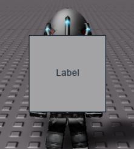
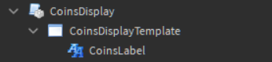

# 1.1 Introduction

Next tutorial: [1.2 Rocrastinate Store](1-2-rocrastinate-store.md)

[Directory](../README.md#tutorial)

## Motivation

[TL;DR: This is background; click here to dive straight into using Rocrastinate](#creating-your-first-component)

Roblox UI is not always easy to standardize. Making UI code that is simultaneously re-usable, decoupled, and high-performing on Roblox is ideal, but having all of three these things at the same time can be prove challenging.

Frameworks such as [Roact](https://github.com/Roblox/roact) by LPGhatguy (generally accompanied with [Rodux](https://github.com/Roblox/rodux)) have been created to parallel Facebook's [React](https://github.com/facebook/react) framework (generally accompanied with [Redux](https://redux.js.org/)).

These frameworks offer a declarative approach to UI by instantly rendering accurate information to the user, as well as managing state so that the data displayed to the user derives from a single source of truth. This allows UI to be made that is responsive, re-usable, and accurate at all times.

While these frameworks do their job well, Roact/Rodux has some particular disadvantages in the context of Roblox development:
- Roact abstracts away important UI features, such as Tweening, or reading properties from rendered objects. This can get pretty hairy try doing certain simple things that are otherwise simple to do without Roact.
- Roact does not allow you to design UI templates; all UI must be created by script. While I wrote a script to somewhat [automate this](https://pastebin.com/jW4k4Ze7) for roblox-ts, if you have non-programmer UI designers on your team, this barrier can become overly complex to deal with.
- Rodux reconstructs the entire store model for every action that is dispatched. Lua tables are significantly slower to deal with than JavaScript objects.
- Roact requires you to declaratively re-state every single property on every single rendered GUI object every time a component is updated. This can have negative performance implications, especially on UI that updates many times per frame.
- Roact creates and destroys instances rapidly. There is no room for optimizations such as object pooling, which should otherwise be simple to implement outside of Roact.
- Unless paired with [roblox-ts](https://roblox-ts.github.io/), the syntax for declaring Roact components can be rather verbose, whereas facebook's React uses JSX (an HTML-like syntax that makes things a lot more readable)


# Features of Rocrastinate
Rocrastinate offers similar benifits to Roact and Rodux, while still giving the developer a large amount of control over when and how UI is redrawn.

The main optimization of Rocrastinate, and its namesake, is that UI Component updates are "procrastinated" (i.e. only ever updated once per frame at most). This allows complex display updates to be deferred whenever a portion of your application's state changes, as each component will only be re-drawn as little as it needs to be redrawn.

## Creating your first Component

Components are classes that can be created using
```lua
local myComponentObject = MyComponent.new(...)
```
and destroyed using
```lua
myComponentObject:Destroy()
```

If you are unfamiliar with object oriented programming in lua, I would highly recommend reading [this tutorial](https://devforum.roblox.com/t/all-about-object-oriented-programming/8585)

To declare our first Component class, Rocrastinate provides the following API
```lua
local Rocrastinate = require(location.of.Rocrastinate)
local MyComponent = Rocrastinate.Component:extend()
```

When a new Component object is created using `MyComponent.new()`, the `constructor` is called with the same arguments passed through `new`. Here is a simple printer component:

```lua
local Printer = Rocrastinate.Component:extend()

function Printer:constructor(message)
    self.message = message
end

function Printer:Print()
    print(self.message)
end

local myPrinter = Printer.new("Hello, World!")
myPrinter:Print() -- Hello, World!
myPrinter:Destroy() -- ( Currently has no effect, but is still a thing we can do )
```

While this has nothing to do with UI, it is a good example of the object-oriented structure we will be using for the rest of the tutorial

### UI components

Rocrastinate gives total control over what a component does when it is constructed. You can create as many Gui objects as you like, and update them however you like.

The information we actually display to the user can be controlled using the Component class' `:Redraw()` method. **You should not call :Redraw() directly**, as this is automatically called on RunService.RenderStep or RunService.Heartbeat depending how our Component class is set up.

To queue a redraw on the next frame, use `self.queueRedraw()` instead. This is an anonymous, idempotent function that tells Rocrastinate to call `:Redraw()` automatically on the next RenderStep or Heartbeat. It should be noted that when a component is constructed, Rocrastinate automatically calls `self.queueRedraw()` once.

We can control whether `:Redraw()` is called on RenderStep or Heartbeat using the static `RedrawBinding` property of components.

Let's say we wanted to create a 'CoinsDisplay' component, which draws some representation of how many coins a player has.
```lua
local Rocrastinate = require(game.ReplicatedStorage.Rocrastinate)
local CoinsDisplay = Rocrastinate.Component:extend()

function CoinsDisplay:constructor()
    self.coins = 0

    self.gui = Instance.new("ScreenGui")
    self.coinsLabel = Instance.new("TextLabel", self.gui)
    self.coinsLabel.Size = UDim2.new(0, 100, 0, 100)

    self.gui.Parent = game.Players.LocalPlayer:WaitForChild("PlayerGui")
end

function CoinsDisplay:AddCoin()
    self.coins = self.coins + 1

    self.queueRedraw()
end

CoinsDisplay.RedrawBinding = "Heartbeat"
function CoinsDisplay:Redraw()
    self.coinsLabel.Text = self.coins
end

-- Add 1 coin every second
local myCoinsDisplay = CoinsDisplay.new()
while wait(1) do
    myCoinsDisplay:AddCoin()
end

```


As you can see this component functions as intended. However, there is one small problem: What would happen if we were to destroy the CoinDisplay component?

```lua
local myCoinsDisplay = CoinsDisplay.new()
myCoinsDisplay:AddCoin()
myCoinsDisplay:Destroy()
```


Now wait a minute... why is the GUI still appearing? Furthermore, why are we seeing the text "Label" instead of the number 1 or 0?

While it's true that the state of `self.coins` should have been set to 1 after calling `:AddCoin()`, the `myCoinsDisplay` object was destroyed before the next Heartbeat frame started.

Thus, even though `self.queueRedraw()` was called, this line of code never ran, as Rocrastinate automatically unbinds queued redraws once a component is destroyed:

```lua
function CoinsDisplay:Redraw()
    self.coinsLabel.Text = self.coins
end
```
Since the Text property was never set, it was left with the default value of all TextLabel objects: "Label"

We also have one other problem: the `gui` and `coinsLabel` objects are still parented to PlayerGui when `CoinsDisplay:Destroy()` is called. While we could define a destructor and remove them there:

```lua
function CoinsDisplay:Destroy() -- Note: Do not do this
    self.gui:Destroy()
end
```

The problem is that keeping track of every every object that is created can become unmanageable, especially after creating a large number of components
```lua
function MyApp:constructor()
    self.myComponentA = ComponentA.new( . . . )
    self.myComponentB = ComponentB.new( . . . )
    self.myComponentC = ComponentC.new( . . . )
    self.myFrame = Instance.new("Frame")
end

function MyApp:Destroy() -- Note: Do not do this
    self.myComponentA:Destroy()
    self.myComponentB:Destroy()
    self.myComponentC:Destroy()
    self.myFrame:Destroy()
end
```
Seems like a lot of work, right? Now, if you want to add or remove elements from your UI Component, you have to also add or remove it from the Destructor. If you forget to do this, bad things can happen. Furthermore, what if components/Gui Objects are created during `MyApp:Redraw()` rather than `MyComponent:constructor()`? Now you have to use an if statement to conditionally check if the object even exists, and if it does, destroy it in the destructor.

Rocrastinate utilizes the Maid pattern for Component destructors. The Maid pattern is a helper class for creating destructors, and has been used in many roblox core scripts but is rarely explained. Every Component is given a `maid` object in place of a destructor. In fact, Rocrastinate will actually throw an error if you try to redefine `Component.Destroy()` and `Component.new()` on a Component class.

Going back to the CoinsDisplay example, our `maid` object can be utilized in the constructor as follows
```lua
function CoinsDisplay:constructor()
    self.coins = 0

    self.gui = Instance.new("ScreenGui")
    self.coinsLabel = Instance.new("TextLabel", self.gui)
    self.coinsLabel.Size = UDim2.new(0, 100, 0, 100)

    -- Add our created objects as cleanup tasks
    self.maid:GiveTask(
        self.gui,
        self.coinsLabel
    )

    self.gui.Parent = game.Players.LocalPlayer:WaitForChild("PlayerGui")
end
```

`:GiveTask()` is a special function that takes in a number of destructible tasks. If the maid is given an Instance, then that instance will automatically be destroyed when the Component is destroyed. The maid can also handle custom tables with a `:Destroy()` function implemented (such as other Rocrastinate Components). `:GiveTask()` accepts multiple arguments, and adds each argument to the maid's task queuem which is automatically cleaned up when the component is destroyed.

For more information on Component Maids, see: [1.5 Maid Revisited](1-5-maid-revisited.md)

### Improving our Component class

Now, I will attempt to explain some improvements that can be made to our `CoinDisplay` code.
First of all, we don't actually need to create our gui objects until `:Redraw()` is called. For the sake of separation of concerns, it would be better to move that into the `:Redraw()` function.

```lua
function CoinsDisplay:constructor()
    self.coins = 0

    -- Note: self.queueRedraw() is automatically called after the CoinsDisplay object is created
end

CoinsDisplay.RedrawBinding = "Heartbeat"
function CoinsDisplay:Redraw()
    -- This will run once on the first frame that our CoinsDisplay element is rendered (if it is rendered)
    if not self.gui then
        self.gui = Instance.new("ScreenGui")
        self.coinsLabel = Instance.new("TextLabel", self.gui)
        self.coinsLabel.Size = UDim2.new(0, 100, 0, 100)

        self.maid:GiveTask(
            self.gui,
            self.coinsLabel
        )

        self.gui.Parent = game.Players.LocalPlayer:WaitForChild("PlayerGui")
    end

    self.coinsLabel.Text = self.coins
end
```

See how much cleaner the constructor is? Now, when we want to locate the portion of code that draws what is displayed to the user, we need only look at the `:Redraw()` function.

Secondly, we do not need to keep track of our coinsLabel frame, as it is already parented to our Gui (we also do not need to give it to the Component's maid for that matter)

```lua
function CoinsDisplay:Redraw()
    if not self.gui then
        self.gui = Instance.new("ScreenGui")
        self.maid:GiveTask( self.gui ) -- Only the gui needs to be given to the maid

        local coinsLabel = Instance.new("TextLabel")
        coinsLabel.Name = "CoinsLabel"
        coinsLabel.Size = UDim2.new(0, 100, 0, 100)
        coinsLabel.Parent = self.gui

        self.gui.Parent = game.Players.LocalPlayer:WaitForChild("PlayerGui")
    end

    self.gui.CoinsLabel.Text = self.coins -- Here we index gui instead of coinsLabel
end
```

We can simplify this even further; `maid:GiveTask()` conveniently returns the arguments we pass to it. This means that we can create the gui and add it as a maid task on the same line, making it easier to track that this object needs to be destroyed with the component:

```lua
self.gui = self.maid:GiveTask(Instance.new("ScreenGui"))
```

---

We deferred creation of our `self.gui` object until `:Redraw()` is called by Rocrastinate. However, there is one small problem with our code:

```lua
self.gui.Parent = game.Players.LocalPlayer:WaitForChild("PlayerGui")
```
This `:WaitForChild()` is a yielding function. Yielding on a Redraw means our code could be subject to race conditions. In general, you should avoid yielding within `:Redraw()` wherever possible.

Furthermore, it is not ideal to hardcode the parent in which our component's UI is placed. What if, for example, we wanted to nest a `CoinsDisplay` object inside of another menu? Let's define the parent in which we want to place the component as a parameter of the `CoinsDisplay` constructor:

```lua
function CoinsDisplay:constructor(parent)
    self.coins = 0
    self.parent = parent
end
function CoinsDisplay:Redraw()
    if not self.gui then
        . . .

        self.gui.Parent = self.parent
    end

    self.gui.CoinsLabel.Text = self.coins
end
```

Now, when we create our component, we should provide it with a parent argument:

```lua
local PlayerGui = game.Players.LocalPlayer:WaitForChild("PlayerGui")

-- Add 1 coin every second
local myCoinsDisplay = CoinsDisplay.new(PlayerGui)
while wait(1) do
    myCoinsDisplay:AddCoin()
end
```

There is one other thing that will make the code simpler: UI Templates. Because Rocrastinate gives us full control over how our GUI elements are created, we can place a template inside of our component's module:



## Final Code

Here is the final code for the CoinsDisplay module:
```lua
local Rocrastinate = require(game.ReplicatedStorage.Rocrastinate)
local CoinsDisplay = Rocrastinate.Component:extend()

function CoinsDisplay:constructor(parent)
    self.coins = 0
    self.parent = parent
end

CoinsDisplay.RedrawBinding = "Heartbeat"
function CoinsDisplay:Redraw()
    if not self.gui then
        self.gui = self.maid:GiveTask(script.CoinsDisplayTemplate:Clone())
        self.gui.Parent = self.parent
    end
    
    self.gui.CoinsLabel.Text = "Coins: " .. self.coins
end

function CoinsDisplay:AddCoin()
    self.coins = self.coins + 1

    self.queueRedraw()
end

return CoinsDisplay
```

And here is a LocalScript that utilizes the module:
```lua
local CoinsDisplay = require(game.ReplicatedStorage.CoinsDisplay)
local PlayerGui = game.Players.LocalPlayer:WaitForChild("PlayerGui")

-- Add 1 coin every second
local myCoinsDisplay = CoinsDisplay.new(PlayerGui)
while wait(1) do
    myCoinsDisplay:AddCoin()
end
```


---

Next tutorial: [1.2 Rocrastinate Store](1-2-rocrastinate-store.md)

[Directory](../README.md#tutorial)