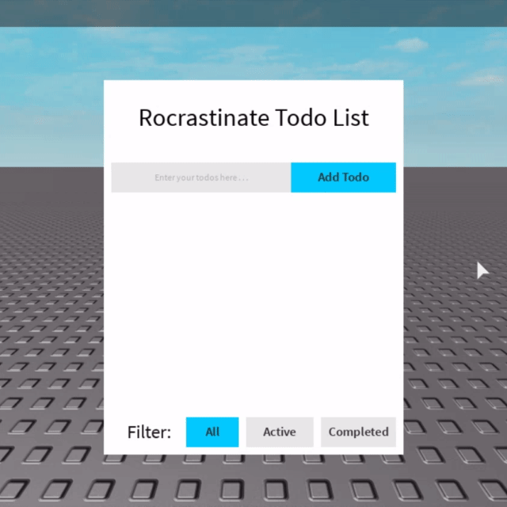
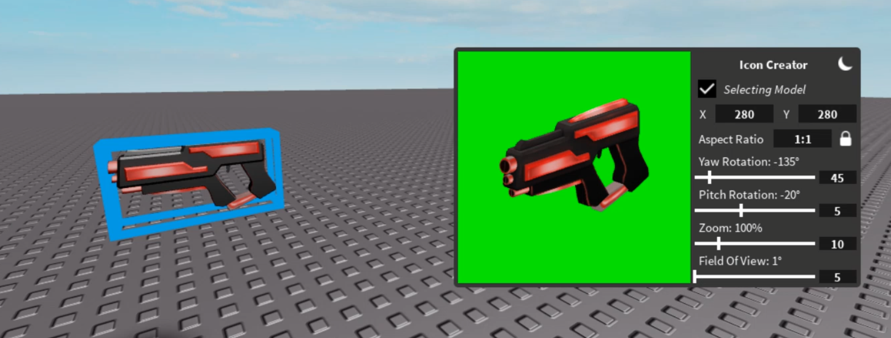

# 1.6 Usage Examples

Next tutorial: [2.1 Middlewares](docs/2-1-middlewares.md)

Previous tutorial: [1.5 Maid Revisited](1-5-maid-revisited.md)

[Directory](../README.md#tutorial)

## Todo List App

Here is a small Todo List app built with Rocrastinate, made to mirror the structure of the Todo List app built in the [Redux tutorial](https://redux.js.org/basics/example):

[Todo List (Roblox Place File)](https://raw.github.com/headjoe3/Rocrastinate/master/examples/todos.rbxl)

## Icon Creator Plugin

Here is a plugin I wrote with Rocrastinate in order to test out the viability of the framework, and explore the workflow of creating a Rocrastinate application.
To run the plugin, you can use Anaminus' [HotSwap Plugin](https://www.roblox.com/library/184216383/HotSwap-v1-1)

In both examples, the code is located in ReplicatedStorage, as well as a composite UI template can be found in StarterGui, which was used to design the UI in both applications.

---

Next tutorial: [2.1 Middlewares](docs/2-1-middlewares.md)

Previous tutorial: [1.5 Maid Revisited](1-5-maid-revisited.md)

[Directory](../README.md#tutorial)
